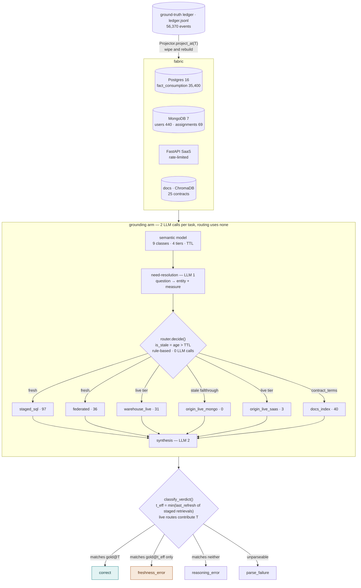

# ChurnBench Architecture

A drift-aware benchmark for grounding agentic AI over enterprise data fabrics.
Every mutation lands in a ground-truth ledger, so an answer given at time `T` is
scored against the true state at `T` — and against whatever earlier state a stale
cache actually served.

| | |
|---|---|
| Ledger events | 56,370 |
| Tasks | 180 across 3 tiers |
| Entity classes | 9 across 4 freshness tiers |
| Retrieval routes | 6 |
| Tests | 316 |

---

## 1. Ledger to verdict, end to end

The ledger is the only source of truth. Everything below it — the four fabric
layers, the staged cache, the gold answers — is a projection of that ledger to
some timestamp. That is what makes it possible to ask what the world looked like
at `T` *and* at `t_eff` for the same question.



Route counts are from the D+28 baseline run (207 retrievals across 180 tasks).

Two things worth noticing:

- **Routing costs zero LLM calls.** The model never chooses a data source. It
  resolves the question into an entity and a measure; a rule decides where the
  data comes from.
- **`origin_live_mongo` is 0.** With refresh scheduling on, no Mongo-backed
  entity was ever stale enough to fall through to its origin.

---

## 2. Nine entity classes, four freshness tiers

Each class declares an origin, a TTL, and the measures it can answer. The TTL
alone determines the refresh period the scheduler holds it to — and therefore the
ceiling on how stale it can ever be at evaluation time.

| entity class | origin | tier | TTL | refresh period | age ceiling at `T` |
|---|---|---|---|---|---|
| `assignments` | mongo | hot | 1d | every 2d | ≤ 2d |
| `user_status` | mongo | hot | 1d | every 2d | ≤ 2d |
| `prices` | postgres | warm | 7d | every 8d | ≤ 8d |
| `cost_center_membership` | mongo | warm | 7d | every 8d | ≤ 8d |
| `contract_terms` | docs | cold | 30d | never in window | **29d** |
| `vendor_dims` | postgres | cold | 30d | never in window | **29d** |
| `consumption_facts` | postgres | live | — | never staged | 0d |
| `utilization_current` | saas | live | — | never staged | 0d |
| `tickets` | saas | live | — | never staged | 0d |

The two cold rows are the boundary condition that proves the mechanism: **a
30-day TTL never lapses inside a 29-day window**, so scheduling never touches
them, and their age is identical whether scheduling runs or not. That is exactly
why `contract_terms` throws freshness errors in *both* arms of the ablation.

---

## 3. Refresh scheduling, not cache age

`RunHarness._schedule_refreshes()` walks day by day from the cache-build time
`T′` to the evaluation time `T`, refreshing any entity whose TTL has lapsed.
Plotting each entity's age across that walk shows why "older cache ⇒ more
staleness" fails: with scheduling on, age is a bounded sawtooth pinned under its
TTL for the whole window, regardless of window length. With it off, age is simply
elapsed time.


Same 180 tasks, same window, same model, `enable_thinking=False` on both, zero
permanent failures on both. The only edge that changes is whether the daily walk
executes.

---

## 4. Results

### The 2×2

Freshness errors, matched pair, both at `enable_thinking=False`:

| | D+1 (`T′ = T − 1d`) | D+28 (`T′ = T − 29d`) |
|---|---|---|
| **tiering ON** | **7** — 121 correct, 67.2% | **4** — 117 correct, 65.0% |
| **tiering OFF** | **7** — 120 correct, 66.7% | **45** — 66 correct, 36.7% |

The D+1 column is the control that makes the claim falsifiable: at a one-day
window, turning tiering off changes nothing (7 vs 7), because there is no time
for any TTL to lapse. **The effect appears only when the window outruns the
TTLs.**

### Where the 45 errors land

| entity class | tier | errors |
|---|---|---|
| `prices` | warm | 20 |
| `user_status` | hot | 15 |
| `assignments` | hot | 10 |

Hot tier contributes **25 of 45** — and **0 of 4** in the baseline. Scheduling
keeps hot entities 0–2d old, a window too narrow to straddle a mutation.

### Query method mix

207 retrievals, D+28 baseline:

| method | count |
|---|---|
| `templated` | 116 |
| `vector_search` | 40 |
| `federated_template` | 36 |
| `llm_generated` | 12 |
| `api_call` | 3 |

**94% of retrievals resolve through a template** — the LLM writes SQL only for
the long tail.

---

## 5. A measurement trap worth knowing about

`ttl_expired` reads **0 in both arms of the ablation**, for opposite reasons:

- **Tiering ON** — the scheduler refreshes entities *before* their TTL lapses, so
  the router never sees a stale entity.
- **Tiering OFF** — `router.decide()` forces `is_stale = False` and skips the
  check entirely, so it never *reports* a miss even while serving 29-day-old data.

A metric that reports identical values for opposite behaviours is a measurement
trap. The `last_refresh` age (§2, §3) is the honest instrument; the cache-miss
counter is not.

---

## Reproducing

```bash
docker compose -f infra/docker-compose.yml up -d
poetry install

# D+28 matched pair
poetry run churnbench run grounding ./data/full --t-prime 2024-03-29 --t 2024-04-27
poetry run churnbench run grounding_no_freshness_tiers ./data/full --t-prime 2024-03-29 --t 2024-04-27

# D+1 control pair
poetry run churnbench run grounding ./data/full --t-prime 2024-04-26 --t 2024-04-27
poetry run churnbench run grounding_no_freshness_tiers ./data/full --t-prime 2024-04-26 --t 2024-04-27
```

All figures above come from committed run data under `results/*_full.json`, with
complete per-task freshness-error tables in `results/supplementary/`.
