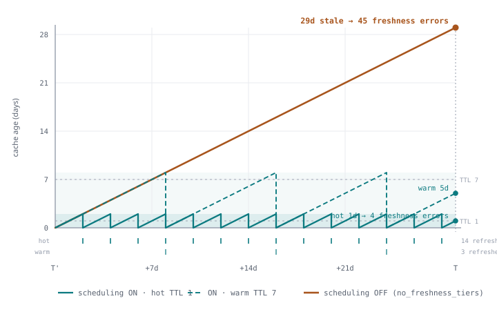

# ChurnBench

**A drift-aware benchmark for grounding agentic AI over enterprise data fabrics.**

ChurnBench is an open-source evaluation instrument that measures how agentic systems
handle **temporal drift** across a heterogeneous enterprise stack: a SQL warehouse,
an operational NoSQL store, a rate-limited SaaS-style REST API, and an unstructured
document corpus.

Every mutation in the simulated fabric is written to a ground-truth ledger, so an
agent's answer at time `T` can be scored against the true world state at `T` —
making **freshness error** measurable, not merely qualitative.

Companion artifact for the paper:
> *ChurnBench: A Drift-Aware Benchmark Demonstrating That Refresh Scheduling,
> Not Cache Age, Governs Staleness in Agentic AI*
> — submission draft in [`paper/churnbench-aixse.pdf`](paper/churnbench-aixse.pdf).

## Headline result

Freshness errors, matched pair, both at `enable_thinking=False`, zero permanent
failures in all four cells:

| | D+1 (`T′ = T − 1d`) | D+28 (`T′ = T − 29d`) |
|---|---|---|
| **tiering ON** | 7 | 4 |
| **tiering OFF** | 7 | **45** |

Cache age alone predicts almost nothing. Whether the refresh scheduler ran
predicts an 11× swing — and only once the window is long enough for TTLs to
lapse inside it. The D+1 column is the control that makes that claim falsifiable.



**→ [Full architecture, figures, and results](ARCHITECTURE.md)**

## Domain
Software Asset Management (SAM): licenses, users, consumption events, cost centers,
contracts. Drift is intrinsic — licenses get reassigned, contracts renew, users
offboard, prices change.

## Stack
- Postgres 16 — historical/analytical warehouse (star-schema-ish)
- MongoDB 7 — current operational state
- FastAPI — mock SaaS API (rate-limited, intentionally slow)
- Local document store — synthetic contracts and policies (markdown/PDF)
- Everything runs with `docker compose up`

## Quickstart
```bash
# Bring up the fabric
docker compose -f infra/docker-compose.yml up -d

# Install
poetry install

# Generate a dataset at a chosen timeline length
poetry run churnbench generate --days 180 --seed 42 --out ./data/run_001

# Snapshot the world at timestamp T
poetry run churnbench snapshot ./data/run_001 2024-09-15

# Generate evaluation tasks
poetry run churnbench tasks ./data/run_001 --n 180

# Run an experimental arm at a cache-build time T′ and evaluation time T
poetry run churnbench run grounding ./data/run_001 \
  --t-prime 2024-03-29 --t 2024-04-27

# Score results
poetry run churnbench score ./data/run_001
```

## Experimental arms
1. `naive` — agent hits raw sources live per query, no pre-processing
2. `classic_rag` — everything dumped in one vector store, uniform chunking
3. `hierarchical` — worker agents per source, results merged by a coordinator
4. `grounding` — the proposed architecture (semantic model, source-aware routing,
   freshness-tiered caching)

Ablations, one principle disabled each:
`grounding_no_freshness_tiers` · `grounding_no_semantic_model` ·
`grounding_no_source_routing`

## Metrics
- Accuracy vs. ledger ground truth
- Cost per task (USD)
- End-to-end latency
- **Freshness error** — answer wrong at `T` but correct at `t_eff`, the effective
  retrieval time of the data actually served (`min(last_refresh)` across staged
  retrievals; live routes contribute `T`). Distinguishing this from an ordinary
  reasoning error requires scoring against *two* references, not one.

## Paper

The [`paper/`](paper/) directory contains the LaTeX source and the current
submission draft, [`churnbench-aixse.pdf`](paper/churnbench-aixse.pdf).

**This repository is the reference implementation and benchmark for the paper.**
The code in `churnbench/` is the artifact described in the paper; results produced
by running the benchmark fill the `[DATA REQUIRED]` placeholders in the LaTeX
source.  See [`paper/README.md`](paper/README.md) for build instructions and the
placeholder convention.

Committed result data, so reviewers can verify the ground truth and not just the
arithmetic:

- `data/full/ledger.jsonl` — the ground-truth ledger every gold answer derives from
- `results/*_full.json` — complete per-task result sets, including `retry_provenance`
- `results/summary_*.json` — lightweight aggregate summaries
- `results/supplementary/` — complete freshness-error tables as CSV, per run and combined

Raw traces (`*.traces.jsonl`) and checkpoints stay gitignored. A `[DATA REQUIRED]`
marker is only replaced when the corresponding committed result exists — never
with an estimated number.

## License
[MIT](LICENSE)

## Citation
BibTeX entry will be added once the paper is published.
